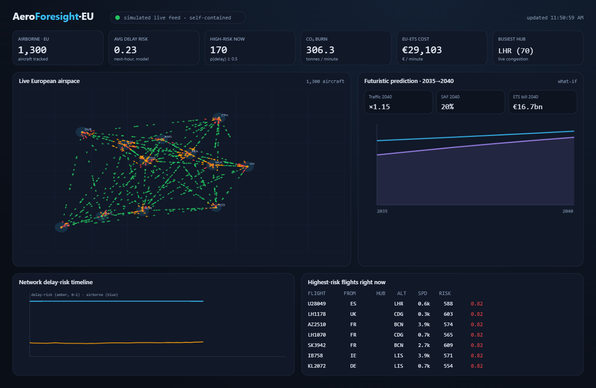
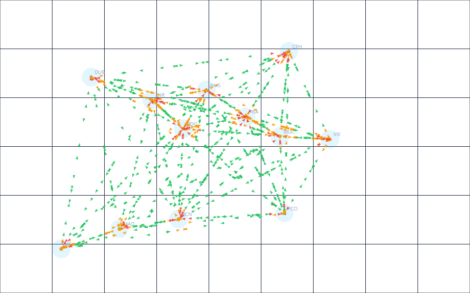
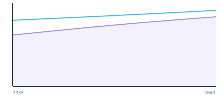
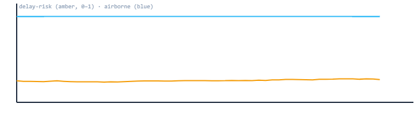

<div align="center">

# ✈️ AeroForesight‑EU

### Real‑time European aviation intelligence & **foresight** platform

Live‑stream every aircraft over Europe, predict which flights will run late,
price the carbon in the sky right now, and project the **2040** cost of European
aviation under EU‑ETS + ReFuelEU SAF mandates all in the browser.

[](LICENSE)


<br/>



<sub>Live ops screen — real airspace map, delay‑risk model, live EU‑ETS carbon cost, and an interactive 2040 forecast, all streaming.</sub>

</div>

---

## What it does

AeroForesight‑EU captures **live flight state** over Europe, runs a prediction
layer over it, and streams the result to a real‑time dashboard  combining
**Deep Learning**, **Reinforcement Learning**, an **LLM foresight layer**, and a
full **MLOps** pipeline.

| Question | Who cares | Answered with |
|---|---|---|
| Which flights will arrive late, and why? | Airline OCC, airports | **DL** delay predictor |
| Where should we invest limited schedule buffer? | Network planning | **RL** buffer‑allocation agent |
| How concentrated & connected is the network? | Regulators, strategy | **Business analytics** (HHI, connectivity, revenue‑at‑risk) |
| What does 2040 cost under EU‑ETS + SAF mandates? | CFO, sustainability | **Scenario forecaster** (Baseline / Green Push / High Growth) |
| What should leadership actually do? | Executives | **LLM** foresight briefing |

---

## 🔴 Run it live (zero install, ~10 seconds)

The `live/` app streams **real aircraft** from the OpenSky Network and predicts
the future in your browser. No Python, no build step, **zero dependencies**
(Node built‑ins only).

```bash
cd live
node server.js          # → http://localhost:8787
```

```
OpenSky /states/all (live)  ──poll 10s──►  ingest.js  ──►  data/captures/*.jsonl   (data capture)
        │  auto‑fallback to physics‑lite simulator if offline        │
        ▼                                                            ▼
   predict.js  (delay‑risk · live EU‑ETS € cost · 2040 scenarios) ──►  SSE /stream ──►  live dashboard
```

Verified live: **~2,600 real aircraft** tracked, LHR the busiest hub, 2040 EU‑ETS
bill projected at **€16.7 bn** (Baseline) rising to **€18.1 bn** under Green Push.

> No network? It transparently falls back to a seeded flight simulator, so the
> dashboard always runs. A fully self‑contained, no‑server version lives at
> [`dashboard/live_foresight.html`](dashboard/live_foresight.html) — just open the file.

---

## Screenshots

### Live European airspace
Each triangle is an aircraft, coloured by **modelled delay risk** (green → amber →
red); hubs are sized by live congestion.



### Futuristic prediction · 2035 → 2040
An interactive what‑if projected off the **current** sky — traffic growth, SAF
blend and the EU‑ETS carbon bill, across three policy scenarios.

<table>
<tr>
<td width="55%"></td>
<td valign="top">

| Scenario | 2040 traffic | SAF blend | ETS bill |
|---|---|---|---|
| Baseline | ×1.15 | 20 % | **€16.7 bn** |
| Green Push | ×1.09 | 42 % | **€18.1 bn** |
| High Growth | ×1.22 | 14 % | **€15.0 bn** |

<sub>Cyan = traffic index · violet = ETS cost (€bn/yr). Higher carbon price under Green Push outweighs the greener fuel.</sub>

</td>
</tr>
</table>

### Network delay‑risk timeline
Rolling, live — network‑wide average delay risk (amber) against airborne count (blue).



---

## The live stack

| Layer | File | What it delivers |
|---|---|---|
| **Live capture** | `live/ingest.js` | Polls OpenSky (Europe bbox), normalises state vectors, appends snapshots to `data/captures/`. Seeded‑simulator fallback when offline. |
| **Prediction** | `live/predict.js` | Per‑flight next‑hour delay risk, live CO₂ burn + EU‑ETS € cost, and the 2035→2040 scenario projection. |
| **Streaming server** | `live/server.js` | Aggregates each snapshot and pushes it over **Server‑Sent Events**; REST at `/api/snapshot`, `/api/forecast`, `/api/health`. |
| **Live dashboard** | `live/public/index.html` | Real‑time airspace map, KPI tiles, rolling timeline, top‑risk flights, interactive 2040 what‑if — vanilla JS/canvas, no CDN. |

---

## The MLOps reference stack (Python)

The `src/aeroforesight/…` package is the full offline implementation — the same
foresight, trained and served properly. Use it when you have **Python 3.10+**.

```bash
pip install -e ".[dl,llm,dashboard,dev]"      # or: make install
python -m aeroforesight.mlops.pipeline         # generate → train DL+RL → forecast → brief
uvicorn aeroforesight.serving.api:app --reload # http://localhost:8000/docs
streamlit run dashboard/streamlit_app.py       # http://localhost:8501
```

Or with Docker:

```bash
docker compose up --build     # API :8000/docs · Dashboard :8501
```

<details>
<summary><b>Architecture</b></summary>

```
 Feeds (OpenSky / Eurocontrol   ┌──────────────────────────────────────────┐
  stand‑in)  ─────────────────▶ │ data.generate → features.build           │
                                └──────────────┬───────────────────────────┘
                    ┌──────────────────────────┼─────────────────────────────┐
                    ▼                ▼          ▼               ▼
            DL delay model    RL network agent  Scenario forecast   Business
            (PyTorch/sklearn) (Q‑learning)      (2040, ETS+SAF)     analytics
                    │                │          │               │
                    └───────┬────────┴────┬─────┴───────────────┘
                            ▼             ▼
                 MLOps: gate → registry   LLM foresight briefing
                      → drift monitor       (Claude, opt‑in)
                            │                     │
                            ▼                     ▼
                 FastAPI service  ◀────▶  Streamlit + Plotly dashboard
```
</details>

<details>
<summary><b>Components</b></summary>

- **🧠 DL — delay predictor** (`models/dl_delay.py`) — feed‑forward net for
  P(arrival delay > 15 min); PyTorch with a scikit‑learn fallback so it trains anywhere.
- **🎯 RL — network optimiser** (`models/rl_network.py`) — tabular Q‑learning agent
  allocating limited schedule buffer across congested hubs.
- **🔭 Forecasting** (`models/forecast.py`) — deterministic 2040 paths for traffic,
  SAF adoption, EU‑ETS price, CO₂ and green cost.
- **🏢 Business analytics** (`models/business.py`) — route economics, market share,
  hub concentration (HHI), connectivity, delay revenue‑at‑risk.
- **💬 LLM briefing** (`models/llm_insights.py`) — feeds structured outputs to Claude
  (`claude-opus-4-8`, adaptive thinking, streamed); deterministic template offline.
- **⚙️ MLOps** (`mlops/`) — `pipeline.py` orchestration, `registry.py` model registry,
  `monitoring.py` PSI drift + performance gate.

</details>

<details>
<summary><b>REST API</b></summary>

| Method | Path | Purpose |
|---|---|---|
| GET  | `/health` | liveness + loaded model version |
| POST | `/predict/delay` | delay probability for a flight |
| GET  | `/network/kpis` | current network KPIs |
| GET  | `/forecast` | 2040 scenario forecast |
| GET  | `/rl/recommend?bands=2,1,2,0` | RL buffer allocation |
| GET  | `/briefing` | latest executive foresight briefing |

```bash
curl -X POST localhost:8000/predict/delay -H 'content-type: application/json' \
  -d '{"origin":"LHR","dest":"FRA","carrier":"LH","congestion":1.8,"weather_index":3.2}'
```
</details>

> Runs **without any API key**. Set `ANTHROPIC_API_KEY` in `.env` (copy `.env.example`)
> to turn the templated briefing into a full Claude‑written narrative.

---

## Project layout

```
AeroForesight-EU/
├── live/                     # 🔴 zero‑dep live streaming app (Node)
│   ├── ingest.js  predict.js  server.js  airports.js
│   └── public/index.html     # real‑time SSE dashboard
├── dashboard/
│   ├── live_foresight.html   # self‑contained, no‑server dashboard
│   └── streamlit_app.py
├── src/aeroforesight/        # MLOps reference stack (Python)
│   ├── data/  features/  models/  mlops/  serving/
├── config/config.yaml        # hubs, carriers, model + scenario params
├── docs/img/                 # screenshots
├── tests/test_smoke.py
├── Dockerfile · docker-compose.yml · Makefile · .github/workflows/ci.yml
└── requirements.txt · pyproject.toml
```

Run the tests: `pytest -q` (or `make test`).

---

## Notes & disclaimers

- OpenSky provides real positions; the **prediction models are illustrative**
  (a distilled version of the DL/RL stack), not operational or investment advice.
- The Python `data/generate.py` synthetic feed is swappable for real OpenSky /
  Eurocontrol / OAG connectors without touching the model or serving code.

## Author

**Abhishek Hirve** — MS in Artificial Intelligence, Verona, Italy.

## License

Released under the [MIT License](LICENSE) — © 2026 Abhishek Hirve, Verona, Italy.
